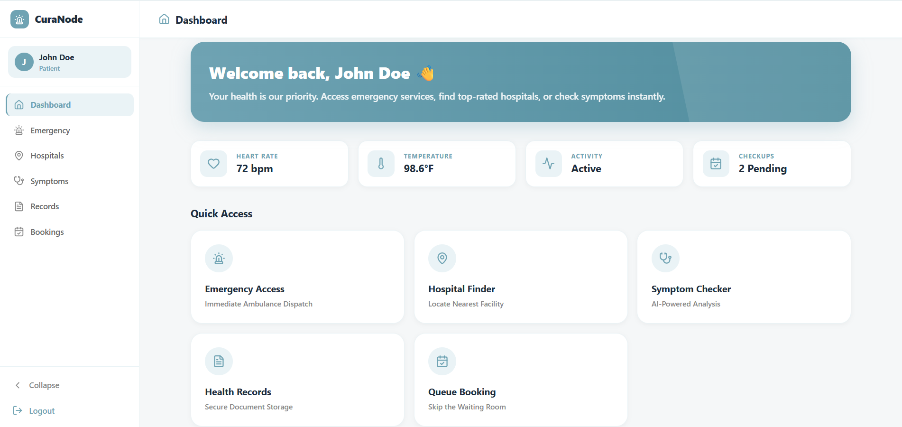
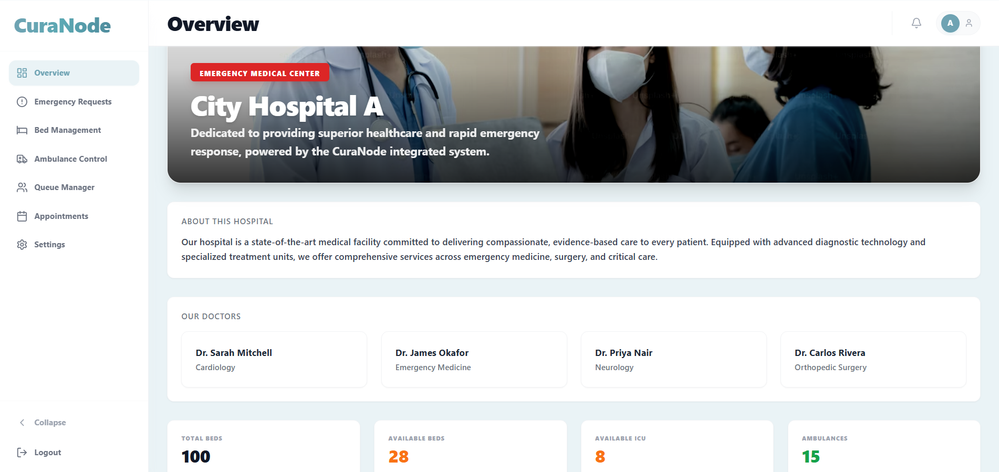

# 🚑 CuraNode – Smart Emergency Healthcare Coordination System

## 🏆 24-Hour Hackathon Project | Healthcare Innovation Theme

CuraNode is a MERN-based real-time healthcare coordination platform designed to improve emergency response efficiency by intelligently connecting patients and hospitals.

---

## 👩‍⚕️ User Dashboard Features

- 🔴 Fast Help Button (Live location sharing for ambulance)
- 🔐 Authentication (Login/Register)
- 📅 Appointment Booking
- 🤒 Symptom Checker
- 📁 Prescription & Health Record Storage
- 🏥 Smart Hospital Recommendation

---

## 🏥 Hospital Dashboard Features

- 🚑 Real-time Ambulance Tracking (Socket.io)
- 🛏 Bed & Resource Management
- 📊 Emergency Request Monitoring
- 📋 Appointment & Queue Manager
- ⚙ Profile & Settings Management

---

## 🧠 Smart Hospital Recommendation Logic

Hospitals are recommended based on a weighted scoring system:

Score = Distance + Bed Availability + Emergency Severity

This ensures:
- Nearest hospital
- Available beds
- Priority handling for critical patients

---

## 🛠 Tech Stack

- MongoDB
- Express.js
- React.js (Vite + Tailwind)
- Node.js
- Socket.io
- JWT Authentication

---

## 📂 Project Structure
CURANODE
├── hospitalproject
└── userProject

---

## 💡 Key Learnings

- Real-time system implementation using sockets
- Backend–frontend integration in MERN
- Emergency prioritization logic design
- Rapid prototyping using AI-assisted development tools
- Team collaboration under 24-hour constraint

---

## 🚀 Future Improvements

- AI-based severity prediction model
- Predictive hospital load analytics
- Government healthcare integration
- Mobile application support

---
## 📸 Screenshots

### 🧑‍💻 User Dashboard

### 🏥 Hospital Dashboard

## 🎥 Project Demo

🔗 **Watch Full Demo Video:**  
[CuraNode Healthcare Hackathon Demo](https://drive.google.com/file/d/1ytZ2VLuiM48cJWGdmG1nVyVg_5uC1Ear/view?usp=sharing)

## 👩‍💻 Developed By

Mary Sophia R  
24-Hour Hackathon Participant